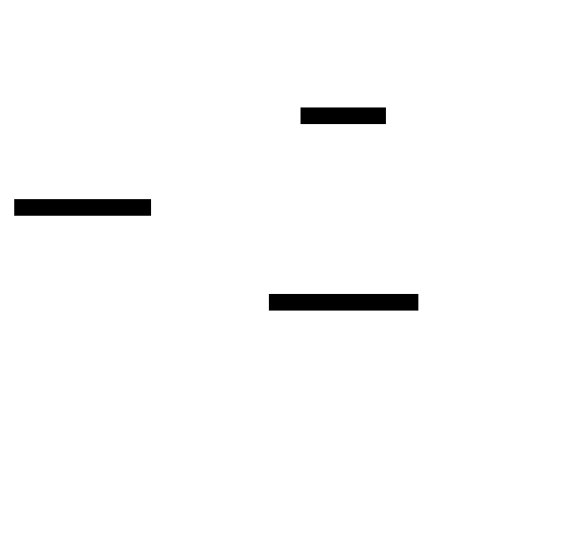

# Architecture

How the cluster substrate is put together, and the path a datagram takes from the wire to a
protocol handler. Read `README.md` first for the shape and the layering; this is the map.



<!-- Diagram: assets/architecture.svg. Edit the D2 source below and re-render with:
     d2 --theme 0 --pad 20 <this-source>.d2 assets/architecture.svg

```d2
# cluster: Raft consensus riding a multicast gossip Bus.
direction: down
app: "application\n(e.g. Discovery: membership + primary election)" { style.fill: "#e8f5ee" }
raft: "cluster::Raft\n(terms, leader election, AppendEntries, commit-on-majority)" { style.fill: "#eef2f7" }
bus: "cluster::Bus\n(framed multicast gossip datagrams)" { style.fill: "#eef2f7" }
net: "UDP multicast (on the reactor runtime)" { style.fill: "#faf3e6" }
app -> raft: "propose / apply"
app -> bus: "send / recv app messages"
raft -> bus: "consensus RPCs ride the bus"
bus -> net
```
-->

## Dependencies

**[reactor](https://github.com/Kronuz/reactor)** (which brings standalone
**asio**), pulled in by CMake `FetchContent`; otherwise header-only. The node type, its
state hooks / `apply(command)`, the message codec, and logging are **injected seams**
(see [What lives above](#what-lives-above-the-injected-seams)), not dependencies.

## The layering

```
      app        its node type + state hooks + apply(command) + its own message types
     ---------------------------- the injected seams ----------------------------------
  cluster   Bus         versioned, token-scoped, typed multicast messaging   [done]
            Raft        term/log/role/votes + election + append + commit     [done]
            gossip      HELLO/WAVE/SNEER/ENTER/BYE naming + the node table    [next]
            length      the varint length + length-prefixed string codec (wire-compat)
     ---------------------------------------------------------------------------------
  reactor   UdpServer / PeriodicTimer / Signal   -- the Asio UDP transport + loop
```

Raft and the membership gossip are two protocols **multiplexed on one multicast socket** (the
`Bus`): every node hears every datagram, and the message *type* selects the handler. They also
share the node table and the cluster state, so they live in one lib (Raft is a separable module,
not a separate repo). The app is injected — it provides the node type, the apply callback, and
the cluster-lifecycle hooks; the substrate never learns the app's domain.

## The wire frame

Every message on the bus is one UDP datagram with a fixed prefix, byte-compatible with Xapiand's
classic discovery transport (so a migrated node interoperates with an un-migrated one):

```
  +--------+--------+--------+------------------------+-----------------+
  | major  | minor  |  type  | serialise_string(token)|     content     |
  |  1 B   |  1 B   |  1 B   |  varint len + token    |   type-specific |
  +--------+--------+--------+------------------------+-----------------+
```

- **major/minor** — the protocol version. A datagram whose version is *newer* than ours is
  dropped (an old node never misparses a new node's frame).
- **type** — the message type (0..max_type). One type space shared by Raft, gossip, and the app.
- **token** — the cluster name/id; a datagram whose token != ours is dropped, so overlapping
  clusters on the same multicast group ignore each other.
- **content** — the rest, parsed by the type's handler.

The `length.h` codec (`serialise_length` / `serialise_string`) is a varint identical to Xapiand's:
a byte `< 255` is the length verbatim; `0xff` introduces a `(len - 255)` base-128 continuation
with the final byte's high bit set. The unserialise side never throws — it returns `false` on a
truncated/overlong frame, and the bus drops it (gossip is best-effort).

## A datagram's life

```
  a node sends bus.send(type, content)
      -> frame [major][minor][type][token][content]  -> reactor::UdpServer multicast send
  every node in the group receives it (IP_MULTICAST_LOOP includes the sender on one host)
      -> UdpServer receive loop -> Bus::on_datagram(bytes, from)
      -> validate: size >= 4, version <= ours, type in range, token == ours   (else drop)
      -> on_message(type, content, from)   ON the bus reactor thread
      -> the app routes by type: Raft handler | gossip handler | app handler
```

## One thread, no locks

The bus runs on a single `reactor::Reactor` (one `io_context`, one thread). The receive loop and
every protocol's timers all run on that one loop, so Raft's term/vote state, the gossip node
table, and the app's handlers are mutated by a single thread and need no locking between the
datagram handler and the timers. This is why the protocols schedule their timers/posts onto
`bus.io()` (`reactor::PeriodicTimer` / `reactor::Signal`), and never touch that state from another
thread. Sends are the one exception — UDP send and receive are independent directions, so
`bus.send()` is safe from any thread — but an ordering-sensitive protocol posts its sends too.

## Raft (`raft.h`) — a faithful port

`cluster::Raft<Node>` is a line-for-line port of the proven Raft in Xapiand's discovery.cc,
made generic: the algorithm and the byte-identical wire format are the module's; everything
app-specific is injected through a `RaftDelegate<Node>` (~16 seams). It owns the term, the
replicated log, the role (follower/candidate/leader), the vote tallies, and the next/match
indexes, and it drives two `reactor::PeriodicTimer`s (election + heartbeat) on the bus loop.

```
  election timeout fires  ->  become CANDIDATE, ++term, broadcast REQUEST_VOTE
  a majority grant         ->  become LEADER, broadcast heartbeats/APPEND_ENTRIES
  a leader's heartbeat     ->  followers reset their election timeout (stay followers)
  add_command (leader)     ->  append to log, replicate via heartbeats, commit on majority
  commit advances          ->  delegate.apply(command) on every node
```

What is injected (the delegate), and why it is larger than a textbook Raft: this Raft is
fused with a cluster-lifecycle by design. Beyond the obvious seams — `broadcast` (transport),
the node serialise/parse, `total_nodes`/`quorum`/`is_alive` (membership), `apply` (the state
machine) — it carries app *policy*: `prefers(a,b)` (a leader-preference / primary-designation
hybrid, Xapiand's `is_superset`), `eligible` (may this node lead), and the lifecycle gates
`active`/`ready`/`joining` + `ensure_setup` (where an app's join state machine plugs in). The
messages also carry full node records, so a receive doubles as a membership touch — that is
the fusion with gossip. The seam is honest about this: it is a generic Raft with injected
policy, not a pretend-pure one.

Only the trace logging is dropped from the port (side-band observability, not behavior).
The timing constants that were fixed in Xapiand (heartbeat 1s, election 4/10/30s) are now
`RaftConfig`, defaulting to those exact values; tests/benchmarks pass tiny values.

`test/raft_test.cc` proves the port standalone — no sockets, no Xapiand — with N in-memory
nodes over a fake broadcast bus: a single stable leader is elected, a command is committed
and applied on every node, and after the leader is killed a new one is elected among the
survivors (3 and 5 nodes). `benchmarks/raft_bench.cc` measures the election latency.

## What lives above (the injected seams)

The app provides, and the substrate never bakes in:
- **the node type** — a serializable identity (`serialise`/`unserialise`/an id), plus its
  app-specific fields (Xapiand's node carries http/remote/replication ports; the substrate
  doesn't care).
- **membership** — how many nodes, quorum, the local node, touch/drop a node (the node *table* is
  the gossip module's, but the app defines the node).
- **the cluster-lifecycle hooks** — "may I participate now?", "I became leader, set up", "apply
  this committed command". These are where an app's state machine plugs into consensus.

Consensus and gossip mechanics stay here; domain policy stays in the app.
